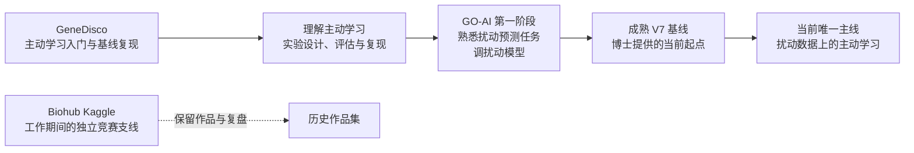
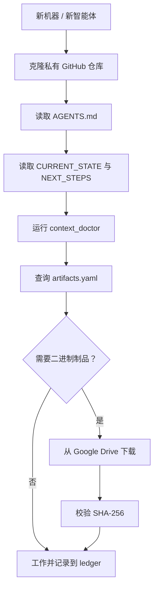

# 请先读我：服务器迁移总蓝图

> 状态：迁移设计、清单与 Drive 写入通道已完成；精选研究包正在上传/校验。没有删除服务器文件。
>
> 更新时间：2026-08-31

这份文档同时给未来的自己、合作者和新智能体阅读。它解决的不是“把服务器原样搬走”，而是让研究主线、关键证据、必要制品和恢复方法在服务器消失后仍然可理解、可验证、可继续。

## 一句话架构

| 层 | 位置 | 保存内容 | 是否是事实来源 |
|---|---|---|---|
| 知识与代码层 | 私有 GitHub 仓库 | 文档、代码、实验账本、配置、清单、恢复脚本 | 是 |
| 二进制制品层 | Google Drive 指定文件夹 | V7 数据、正式模型、关键 OOF、发布包、加密冷备 | 是 |
| 临时源头层 | 旧服务器 | 原始工作区、缓存、重复实验、环境 | 仅在迁移验证前 |

## 1. 研究路线：主线和历史



当前优先级：

1. **GO-AI V7 上的扰动主动学习**：唯一按“可继续工作项目”完整恢复。
2. **GO-AI 第一阶段**：保留任务理解、模型探索、最终 M12/提交材料和经验教训。
3. **GeneDisco**：保留主动学习入门基线、复现方法和学习笔记。
4. **Biohub**：保留个人 Kaggle 作品、最终方法、提交和复盘；不保留全部训练过程。

## 2. 原服务器文件地图

截至 2026-08-31，本地用户目录约 **203 GB**，另有实验室 CIFS 网络盘 `/mnt/Omics_GPU`：

```text
/home/chenyuming/                                  203 GB（本地）
├── Project/                                        72 GB
│   ├── go-ai-rebuild/                              32 GB
│   ├── go-ai/                                      20 GB
│   ├── Biohub - Cell Tracking During Development/  7.8 GB
│   ├── goai-kaggle-model-transfer/                 7.7 GB
│   ├── goai-rna-transfer/                          2.6 GB
│   ├── active-learning/                            1.1 GB
│   └── 审计包、M12 资料包等                         约 0.5 GB
├── biohub_root_fallback/                           95 GB
├── .local/                                         12 GB
├── jiangyuxuan/                                    8.7 GB（需确认所有权，不纳入本计划）
├── .codex/                                         7.2 GB
├── .vscode-server/                                 5.8 GB
├── miniconda3/                                     1.6 GB
└── 其余缓存、工具、配置

/mnt/Omics_GPU/chenyuming/                          上一次完整盘点约 35 GB
```

网络盘仍然挂载在实验室服务器上，但不应被视为搬迁后的可靠来源；迁移前将重新生成它的文件清单。

### 2.1 `Project/` 的真实成分

| 路径 | 当前大小 | 内容判断 | 迁移原则 |
|---|---:|---|---|
| `go-ai-rebuild/runs/` | 26 GB | 大量运行输出、OOF、checkpoint，含 V7 reproduction | 提取 V7 关键制品；其余账本化 |
| `go-ai-rebuild/experiments/` | 5.9 GB | 主要是嵌入 `.conda-env` | 不迁移环境，保留环境定义 |
| `go-ai-rebuild/data/` | 841 MB | 重建和 V7 相关数据 | 按许可和当前依赖保留 |
| `go-ai/runs/` | 20 GB | GO-AI 第一阶段大规模实验 | 保留结论与 promoted 制品 |
| `Biohub/.venv/` | 7.6 GB | 可重建 Python/PyTorch 环境 | 不迁移 |
| `goai-kaggle-model-transfer/models + oof` | 7.8 GB | 历史模型/OOF | 仅保留最终或解释性制品 |
| `goai-rna-transfer/oof` | 2.5 GB | 历史 OOF | 仅保留最终或解释性制品 |
| `active-learning/disco` | 647 MB | GeneDisco 复现数据和结果 | 保存源、版本与复现说明；公开数据不重复搬运 |
| `active-learning/goai_active_learning` | 405 MB | 过渡到当前主线的主动学习代码 | 迁入当前 V7 项目，待逐项审计 |

空间主要来自中间产物而不是知识：

| 文件类型 | 当前总量 | 常见含义 |
|---|---:|---|
| `.npz` | 约 38.2 GB | 中间预测、特征、OOF |
| `.csv` | 约 11.3 GB | 大预测矩阵、多 seed 输出 |
| `.pt` | 约 9.9 GB | checkpoint |
| `.so` | 约 5.2 GB | 环境库，基本可重建 |
| `.json` | 约 695 MB | 配置、收据、manifest |

### 2.2 Biohub fallback

`/home/chenyuming/biohub_root_fallback/` 的 95 GB 主要是：

```text
data/                         82 GB（train 约 81 GB，test 约 1.8 GB）
durable/                      10 GB（大量历史实验目录）
data.partial.../              2.3 GB（未完成下载）
```

Biohub 是历史 Kaggle 项目，因此：公开比赛数据只保存来源、版本、许可、下载方法和哈希；未完成下载和缓存不迁移；`durable/` 只抽取实验表、最终提交、最佳方案和必要模型。主 Biohub 仓库有大量未提交/未跟踪改动，任何清理前都必须先做 Git 快照和补丁。

### 2.3 Codex

`.codex` 的 7.2 GB 不等于 7.2 GB 的关键上下文。它包含 sessions、provider migration 备份、attachments、插件缓存、worktrees、配置和凭据。

保留：项目 `AGENTS.md`、必要配置说明、与当前研究直接有关的会话摘要/附件索引、关键任务背景，以及可选的完整加密冷备。

经本机盘点，真正用于重新安装 Codex 后恢复关键工作方式的最小状态（去密配置之外的 goals/state/memories/queue 等）约为 **22–25 MB**；它应客户端加密后放入 Drive。完整会话历史约 3.23 GB、日志约 1.07 GB、provider migration 备份约 2.01 GB，均不属于核心恢复集。

不进入 GitHub：`auth.json`、`secrets/`、Kaggle token、SSH 私钥、浏览器会话、插件缓存和不相关会话。

未来智能体以版本控制文档为准，完整 `.codex` 只做人工回溯的加密冷备。Codex 会读取仓库的 `AGENTS.md`，并允许更深目录覆盖通用规则，因此 `AGENTS.md` 应指定阅读顺序而非塞入全部历史。[OpenAI 官方说明](https://learn.chatgpt.com/docs/agent-configuration/agents-md)

## 3. 目标仓库结构

```text
260831-/
├── 00_请先读我_服务器迁移总蓝图.md      ← 最显眼入口
├── README.md
├── AGENTS.md                             ← 新智能体启动规则
├── SECURITY.md
├── docs/
│   ├── 00_人类阅读计划.md
│   ├── 01_研究总览.md
│   ├── 02_研究路线与决策史.md
│   ├── 03_原服务器文件地图.md
│   ├── 04_存储与访问说明.md
│   ├── 05_新机器恢复手册.md
│   └── 06_Codex_完整归档与恢复指南.md
├── projects/
│   ├── genedisco/
│   ├── biohub/
│   ├── goai-stage1/
│   └── goai-v7-active-learning/
│       ├── AGENTS.md
│       ├── CURRENT_STATE.md
│       ├── V7_BASELINE.md
│       ├── ACTIVE_LEARNING_PLAN.md
│       ├── DATA_CONTRACT.md
│       ├── DECISIONS.md
│       └── NEXT_STEPS.md
├── inventory/server-2026-08-31/
├── ledgers/
├── manifests/
├── runbooks/
└── scripts/
```

`inventory/` 保存对旧服务器的法证式快照：大小、目录、symlink、Git 状态、大文件、排除原因。`ledgers/` 保存实验和决策。`manifests/` 保存每个 Drive 制品的逻辑 ID、哈希、大小、来源和恢复要求。

## 4. 给人的阅读计划

### 15 分钟快速接手

依次阅读本文件第 0、1、7 节，随后阅读：

1. `docs/01_研究总览.md`
2. `projects/goai-v7-active-learning/CURRENT_STATE.md`
3. `projects/goai-v7-active-learning/NEXT_STEPS.md`

读完应能回答当前研究问题、V7 的角色、下一步和所需制品的位置。

### 90–150 分钟完整交接

| 顺序 | 文档 | 目标 |
|---:|---|---|
| 1 | `docs/00_人类阅读计划.md` | 选择阅读深度 |
| 2 | `docs/01_研究总览.md` | 建立全局目标和词汇 |
| 3 | `docs/02_研究路线与决策史.md` | 理解 GeneDisco→GO-AI→V7 的因果链 |
| 4 | `docs/03_原服务器文件地图.md` | 理解历史文件的来历和去向 |
| 5 | 三个历史项目 README | 知道历史项目对主线的贡献 |
| 6 | `V7_BASELINE.md` | 理解当前可复现基线 |
| 7 | `ACTIVE_LEARNING_PLAN.md` | 理解假设、采样策略、评估协议 |
| 8 | `DATA_CONTRACT.md` | 理解数据版本、字段、许可和泄漏约束 |
| 9 | `04_存储与访问说明.md` | 知道 GitHub 与 Drive 如何配合 |
| 10 | `05_新机器恢复手册.md` | 能够实际恢复并验证 |

## 5. 给智能体的启动和恢复

根 `AGENTS.md` 应要求：

```text
1. 读取 docs/01_研究总览.md。
2. 读取 projects/goai-v7-active-learning/CURRENT_STATE.md。
3. 读取 projects/goai-v7-active-learning/NEXT_STEPS.md。
4. 运行 scripts/context_doctor.sh。
5. 按任务读取对应项目文档，不得把历史项目当成当前主线。
6. 大文件必须先在 manifests/artifacts.yaml 找逻辑 ID，再下载并校验 SHA-256。
7. 新实验必须写入 ledger；改变研究方向必须写入 DECISIONS.md。
```



## 6. Google Drive 的使用规则

云端目标为：[Google Drive 迁移文件夹](https://drive.google.com/drive/folders/19eA2DNfYeuQ_hcAerz95fFJDGQPXORWg?usp=drive_link)。建议内部结构：

```text
00_迁移控制与清单/
01_CURRENT_GOAI_V7/
  01_DATA/
  02_BASELINES/
  03_PROMOTED_RESULTS/
02_ARCHIVE_GOAI_STAGE1/
03_ARCHIVE_GENEDISCO/
04_ARCHIVE_BIOHUB/
90_CODEX_PRIVATE_COLD_BACKUP/
99_MANIFEST_SNAPSHOTS/
```

每个大文件必须有 GitHub manifest：

```yaml
id: goai_v7_dataset
project: goai-v7-active-learning
purpose: 当前扰动学习与主动学习主数据
drive_folder: 01_CURRENT_GOAI_V7/01_DATA
sha256: <required SHA-256>
size_bytes: <required byte size>
sensitivity: private-research
retention: active
restore_required: true
```

Drive 是二进制内容库；GitHub manifest 是定位、版本和校验的唯一事实来源。链接和凭据不能硬编码在代码或 `AGENTS.md` 中。

## 7. 选择规则与迁移容量

| 标签 | 含义 | 去向 |
|---|---|---|
| `ACTIVE_REQUIRED` | 当前 V7 主线运行所必需 | GitHub + Drive |
| `PROMOTED_ARCHIVE` | 历史项目最终/代表性制品 | Drive + manifest |
| `METADATA_ONLY` | 只需知道它做过什么 | GitHub ledger/documentation |
| `REDOWNLOADABLE` | 可从公开/竞赛来源重新取得 | GitHub 记录来源与版本 |
| `REBUILDABLE` | 环境、缓存、编译产物 | 环境定义，不迁移实体 |
| `DUPLICATE` | 内容重复 | 仅保存一个有 hash 的副本 |
| `SENSITIVE_ENCRYPTED` | 会话、私密附件、必要状态 | 加密冷备，不进 GitHub |
| `REVIEW_REQUIRED` | 目前无法判断 | 暂不删，待人工确认 |

### 迁移后的唯一内容预算

| 类别 | 计划大小 | 说明 |
|---|---:|---|
| GitHub：代码、文档、账本、清单 | <0.25 GiB | 不含数据、环境、runs |
| Drive：当前 V7/AL 工作快照 | 约 1.20 GiB（当前压缩包） | 官方数据、V7 三 seed、comparator predictions、AL 正式结果/geometry、BCR 结论证据；BCR 大 OOF 已排除 |
| Drive：精选历史项目制品 | 约 0.32 GiB（当前压缩包） | M12、GeneDisco IL-2、Biohub 两份源码状态、bundle、模型/提交证据 |
| GitHub：代码、文档、账本、清单 | 约 10–30 MiB | 无数据、环境、run、凭据；新智能体的主要入口 |
| **已制备研究包合计** | **1,629,920,623 B = 1.518 GiB** | 13 个包，完整清单与 SHA-256 见 `manifests/` |
| 去凭据 Codex 完整冷备 | 输入量约 7.07 GiB | 需用户掌握的客户端加密密钥和 Codex 静默后的最终一致性快照 |

结论：

- **可恢复研究并让新智能体接续的已制备包：1.518 GiB（加 GitHub 知识库后仍远低于 2 GiB）。**
- **BCR 已核实为结束且无优势的比较，因此只保留 2.84 MB 压缩结论证据；不搬 1.27 GB 内部 OOF。**
- **若加入去凭据 Codex 完整冷备，保守总量约 8.6 GiB；为重试、最终增量和格式开销，Drive 应预留至少 10 GiB。**

95 GB Biohub fallback、20+26 GB GO-AI runs、虚拟环境和服务器缓存均不进入核心迁移集。

## 8. 实施顺序与验收门

1. 安全门：确认 Drive 上传权限；清点不应外传的数据；GitHub 可见性由仓库所有者管理。
2. 只读快照：生成目录、大小、mtime、symlink、Git dirty state、网络盘和大文件清单。
3. 知识提炼：完成四个项目说明、研究路线、ledger、决策日志和阅读计划。
4. 制品筛选：为每个候选大文件打标签；只 hash 计划保留文件。
5. 上传与校验：先上传 Drive，核对大小、hash 和可访问性；再更新 GitHub manifest。
6. 新机器演练：克隆仓库、读取上下文、下载 V7 制品、校验并跑 smoke test。
7. 冻结报告：生成 `MIGRATION_COMPLETE.md`、未迁移清单和删除候选；未经人工批准不删除旧服务器内容。

## 9. 当前状态与尚余门槛

Google Drive 已在用户授权后验证可写，`00_迁移控制与清单/` 已创建；V7 data 与三 seed baseline 已完成首轮上传和远端一致性检查。其余已制备包将按 manifest 逐一上传、核对并标记为 `verified`。

唯一需要用户额外持有的信息是 Codex 全史的客户端加密密钥：出于安全原因，密钥不能由本仓库、普通 Drive 文件夹或聊天记录代管。在密钥就绪前，Codex 完整历史保持为 `pending_user_encryption`，其余研究迁移不受影响。
