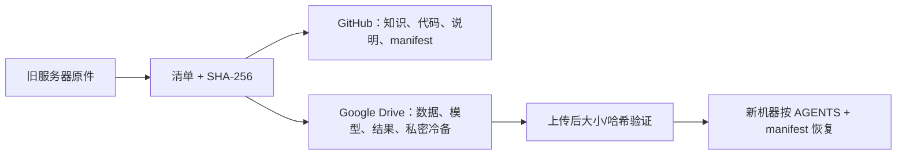

# 迁移执行状态

> 最后更新：2026-08-31（UTC）  
> 原服务器：`172.16.13.200`（旧实验室服务器）  
> 目标 Drive 根目录：用户提供的专用迁移文件夹

## 当前结论

迁移的设计、知识仓库和 Google Drive 写入通道都已经建立。所有精选研究包和 Codex 预快照均已在 Drive 有经校验的副本；旧服务器原件仍保留，**本迁移没有删除、移动或清理旧服务器上的任何文件**。

| 项目 | 状态 | 证据 / 下一动作 |
|---|---|---|
| 迁移知识仓库 | 已建立 | 根目录蓝图、`AGENTS.md`、Codex 恢复指南已存在 |
| Google Drive 授权 | 已验证可写 | 已成功创建 `00_迁移控制与清单/` |
| V7 资产筛选 | 已完成 | BCR 降为结论档案；V7 与 AL 尚未集成已写入恢复文档 |
| 历史项目筛选 | 已完成 | GeneDisco、GO-AI stage 1、Biohub 均有精确选择清单 |
| Codex 冷备 | 已完成（预快照） | 3 个去凭据 `.tar.zst` 包已上传至用户的私有 Drive，并完成逐包 rclone checksum 一致性检查 |
| 上传与校验 | 已完成（紧急迁移范围） | 14 个研究包 + 3 个 Codex 包均已上传、记录 SHA-256 并完成远端一致性检查 |
| 全量研究第二波 | 正在上传 | Drive 新建 `10_全量研究备份_20260831/`；约 307.5 GiB 的用户个人 runs、OOF、模型与网络盘资料分目录迁移。Project 与 Omics GO-AI 因带宽优先级暂缓；Biohub `durable`、DiscoBAX archive、已结束的 FAX 终态快照均已 `rclone check` 验证；RNA transfer 已传完、checksum 校验中；VirtualCODEX 剩余全树暂缓。个人 Trash 中 Go-AI-Optimal 与 phasea archive 已验证，9.439 GiB producers 分卷正在上传。 |

## 本次默认迁移边界

当前已经制备并验证的研究包为 **1,641,096,976 B（1.528 GiB）**。这是经过逐项筛选、压缩且带 SHA-256 的 14 个包，而不是先前的粗略上界。

Codex 去凭据预快照的压缩输出为 **2,732,699,354 B（2.545 GiB）**。因此已验证的总迁移量为 **4,373,796,330 B（4.073 GiB）**：研究包 1.528 GiB，加 Codex 三包 2.545 GiB。原始 Codex 输入约 7.07 GiB，但 `.tar.zst` 有显著压缩率；不应把该压缩率当作未来增量的容量承诺。

如在旧服务器清理前仍有时间，可在关闭/静默 Codex 后再做一份小型最终增量快照；这是一项增强，而不是当前紧急迁移范围的前置条件。

Drive 现有约 4.95 TiB 可用空间，因此用户已授权启动“全量研究第二波”。其范围、当前运行的目录、凭据/他人项目排除项与活跃训练增量策略见 `BULK_MIGRATION_20260831.md`；该波完成前不能标记为已验证。

## 第二波的不可改变边界

第二波约 **307.5 GiB** 是用户个人研究树的逻辑范围，**不含个人回收站候选**。它的每一个顶层目录都仍须做 checksum 验收，不能与上文已经验证的 4.073 GiB 精选包混为一谈。

| 对象 | 决定 | 未来执行者应如何处理 |
|---|---|---|
| `mousebrain/` | 其他人使用用户磁盘完成的项目，**绝不上传** | 远端缺失是正确状态；不得为了“补全”而复制 |
| `biohub_root_fallback/data/`、`data.partial*` | Biohub 竞赛原始数据，用户会自行重新下载，**绝不上传** | 不制作 archive、不从 Trash 恢复、不加入重试队列；此前不完整 Drive 副本已移除 |
| `biohub_root_fallback/durable/` | 用户自己的历史实验树，**仅保留完整压缩 archive** | archive 已通过 checksum；此前直接 copy 不可作为恢复输入 |
| `CYM_DD/FAXP2.0Pro_two_stage_20260831` | 迁移时曾活跃写入的目录 | 训练结束后已增量 copy 并 checksum 验收；canonical 嵌套目录是唯一恢复输入 |
| 个人 Trash 候选 | 独立优先备份清单 | `Go-AI-Optimal`、`phasea_smoke_ntHGJ9` archive 已验证；`producers*` 分卷正在定向上传；不复制整个 Trash，也不上传取消的 Biohub-data 临时 tar |

`正在上传`、`已传完待验` 和 `已验证` 是三个不同状态。只有后者可在 `manifests/` 中登记为可恢复制品；即便验证通过，也不自动授权删除服务器原件。

这不是“把 70 GB 原样搬走”。虚拟环境、可重新下载的公开数据、重复 run、缓存和未晋级结果将留下来源/结论记录，而非搬运实体。

## 不可迁移项

无论仓库可见性如何，以下对象不进入 GitHub 或普通 Drive 文件夹：`auth.json`、`secrets/`、OAuth token、API key、SSH 私钥、Kaggle 凭据、浏览器会话。新机器应重新登录；如用户自行需要凭据灾备，只能使用独立强加密离线介质。

## 完成定义

只有当每个保留对象在 `manifests/` 中有逻辑 ID、来源路径、用途、大小、SHA-256、Drive 目标和验证记录，并且新机器能够按 `AGENTS.md` 找到和校验 V7 所需制品时，迁移才算完成。
