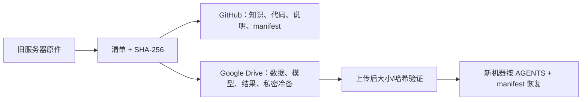

# 迁移执行状态

> 最后更新：2026-08-31（UTC）  
> 原服务器：`172.16.13.200`（旧实验室服务器）  
> 目标 Drive 根目录：用户提供的专用迁移文件夹

## 当前结论

迁移的设计、知识仓库和 Google Drive 写入通道都已经建立。旧服务器仍是唯一原件来源；**本迁移不会删除、移动或清理旧服务器上的任何文件**。

| 项目 | 状态 | 证据 / 下一动作 |
|---|---|---|
| 迁移知识仓库 | 已建立 | 根目录蓝图、`AGENTS.md`、Codex 恢复指南已存在 |
| Google Drive 授权 | 已验证可写 | 已成功创建 `00_迁移控制与清单/` |
| V7 资产筛选 | 已完成 | BCR 降为结论档案；V7 与 AL 尚未集成已写入恢复文档 |
| 历史项目筛选 | 已完成 | GeneDisco、GO-AI stage 1、Biohub 均有精确选择清单 |
| Codex 冷备 | 待打包 | 将排除 `auth.json`、`secrets/` 与所有认证材料 |
| 上传与校验 | 研究包已完成首轮 | 14 个研究包均已上传，且以 rclone checksum 一致性检查通过；Codex 私有冷备待最终一致性/加密步骤 |

## 本次默认迁移边界

当前已经制备并验证的研究包为 **1,641,096,976 B（1.528 GiB）**。这是经过逐项筛选、压缩且带 SHA-256 的 14 个包，而不是先前的粗略上界。

若另加去凭据 Codex 完整历史冷备（输入约 7.07 GiB），保守总量约为 **8.6 GiB**；建议 Drive 留出 **至少 10 GiB** 供最终增量与重试使用。

这不是“把 70 GB 原样搬走”。虚拟环境、可重新下载的公开数据、重复 run、缓存和未晋级结果将留下来源/结论记录，而非搬运实体。

## 不可迁移项

无论仓库可见性如何，以下对象不进入 GitHub 或普通 Drive 文件夹：`auth.json`、`secrets/`、OAuth token、API key、SSH 私钥、Kaggle 凭据、浏览器会话。新机器应重新登录；如用户自行需要凭据灾备，只能使用独立强加密离线介质。

## 完成定义

只有当每个保留对象在 `manifests/` 中有逻辑 ID、来源路径、用途、大小、SHA-256、Drive 目标和验证记录，并且新机器能够按 `AGENTS.md` 找到和校验 V7 所需制品时，迁移才算完成。
