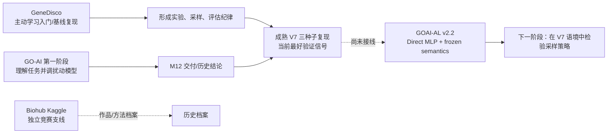

# 研究总览：什么仍在继续，什么只需被理解

> 读者：未来的自己、合作者、或刚启动的新智能体。  
> 首先结论：当前唯一的工作主线是 **GO-AI 扰动预测上的主动学习**；成熟 V7 是最重要的比较基线，但截至迁移日，主动学习框架还没有真正接入 V7。

## 研究地图

## 四个项目卡片

| 项目 | 原始位置 | 角色 | 迁移后的阅读方式 |
|---|---|---|---|
| GeneDisco / DiscoBAX | `Project/active-learning/disco/DiscoBAX` | 主动学习入门与基线复现；帮助理解评估/采样，但不是当前数据集 | 读复现说明、IL-2 pilot 结论与源码；公开缓存数据不搬 |
| GO-AI 第一阶段 | `Project/go-ai`、M12 离线资料包 | 熟悉扰动预测任务、调模型、形成 M12 交付 | 读离线资料包、模型台账与最终提交；大量旧 run/OOF 仅保留账本 |
| Biohub | `Project/Biohub - Cell Tracking During Development` | 工作期间完成的 Kaggle 竞赛；独立作品集 | 保存源码快照、Git bundle、关键模型/提交/回执；不搬 82 GB 竞赛原始数据 |
| GO-AI V7 + AL | `Project/go-ai-rebuild`、`Project/active-learning/goai_active_learning` | 当前研究核心 | 先读 `projects/goai-v7-active-learning/`；按 artifact manifest 下载私有二进制制品 |

## 当前事实，不能混淆

### V7 是什么

V7 是 `proteome_biostate_readout_v7_reproduction` 的三种子复现。其三组完整 run（seed 42/43/44）含 checkpoint、预测、训练史、逐蛋白指标、合同和报告。它在已发布的四个验证场景中优于被比较的 BCR 版本，但这不等于已经完成了因果归因或全部消融。

V7 的关键限制：使用了 instrument/plate observer，模型和 Descriptor MLP 的参数/表征/侧信息并不一致；后续仍需做 plate/instrument、zero/shuffle 等受控消融。不要把“V7 赢了”写成“已解释为何赢”。

### 主动学习框架目前是什么

`goai_active_learning` 的正式 v2.2 结果采用 **Direct MLP + 冻结的 chemical/strain semantic features**。它有正式五 seed 结果和两组 geometry 分析，但它目前没有加载 V7 checkpoint、V7 posterior 或 V7 uncertainty。

因此正确表述是：

> 已经有一个可审计的 GO-AI 主动学习框架，也有一个成熟的 V7 基线；下一阶段是定义二者之间可验证、无泄漏的接口。

绝对不要写成“已经在 V7 上做完主动学习”。

### BCR 的处理

`goai_semantic_bcr_v1` 已结束，不是活跃作业。其内部收据记录 `NO_ADVANTAGE_OVER_FLAT_MLP`；已发布验证比较记录 `V7_WINS_ALL_FOUR_RELEASED_VALIDATION_SCENARIOS`。默认仅保留约 6 MB 的结论证据和源码；1.27 GB 的内部 OOF 不进入默认迁移。

## 给新智能体的第一个任务

1. 读取根 `AGENTS.md`、本文件和 `projects/goai-v7-active-learning/CURRENT_STATE.md`。
2. 明确当前提问是否涉及 V7、AL、BCR 或历史项目；不要默认打开所有旧 run。
3. 若需要数据/模型，先查 `manifests/artifacts.yaml`，再从 Drive 下载并校验哈希。
4. 若要提出下一步实验，先读 `ACTIVE_LEARNING_PLAN.md` 和 `DECISIONS.md`，并将假设、唯一变化、评估协议写入 ledger。

## 核心原则

服务器空间不等于研究知识。可继续的研究由以下四项组成：清楚的问题定义、可复现的数据合同、可验证的正式制品、以及记录过的决策原因。迁移仓库的任务是把这四项拆开保存，使未来不需要翻数十 GB 的 run 或 JSONL 会话才能接手。
