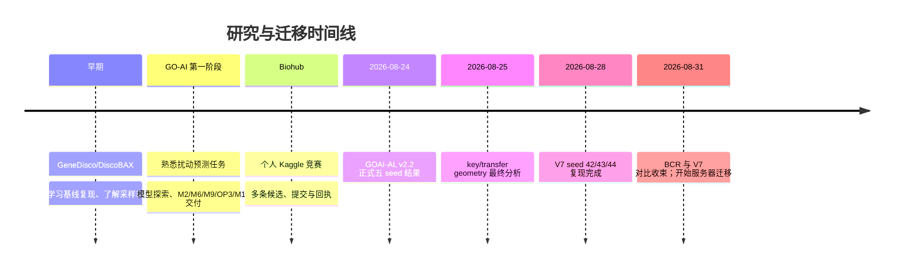

# 研究路线与决策史

本文件记录“为何出现这些目录”，而不是复述每一个训练日志。它是新读者理解取舍的因果链。

## 决策账本

| 日期/阶段 | 决定 | 原因与证据 | 对迁移的影响 |
|---|---|---|---|
| GeneDisco | 保留代码、复现说明和 IL-2 pilot，而非整套公开数据缓存 | Zenodo 数据可按版本和哈希重新取得 | 约 640 MiB 数据只保留来源与哈希 |
| GO-AI stage 1 | 保留 M12 离线资料包、16 个已验证权重和最终 submission | 它们是阶段交付和模型选择证据 | 不搬 20 GB 历史 run 和大 OOF |
| M10.0–M10.8 transfer | 不晋级任何模型 | `RESULTS.md` 已明确拒绝 | 仅保留源码、结果说明与哈希清单 |
| RNA transfer | 保留 M9.6 来源的代码/小工件；最终 OOF 只作可选证据 | OP3 encoder 已纳入 M12 权重集 | 默认不搬 150 MiB OOF |
| V7 | 把 seed 42/43/44 的完整结果作为当前基线 | 可加载、可审计、可复现三种子 | 为当前主线保留完整 checkpoint/预测/合同 |
| GOAI-AL v2.2 | 保留正式五 seed 和最终 geometry 结果 | 它是当前 AL 框架的已验证证据 | 保留结果与源码，不搬 cache |
| BCR | 结论档案化，不作为 active required | 记录显示无相对优势；对比场景 V7 全胜 | 默认仅 6 MB 证据；完整 1.27 GB OOF 为 review-only |
| Biohub | 保护两份不同工作树，不自动合并 | 主工作树与 Codex worktree 同基线但各自 dirty | 保存 main snapshot + Git bundle + worktree patch/archive |
| Codex | 结构化文档是事实来源；完整历史仅为证据库 | 最小恢复远小于完整 sessions | 去凭据冷备与可读索引分开 |

## 未来新增决策如何记录

每一次改变下列任一项，都应在项目 `DECISIONS.md` 或实验 ledger 写入：

* 研究问题或目标指标；
* 数据版本/可用边界；
* 采样策略或标注预算；
* 模型家族、特征组或泄漏防线；
* 哪个结果“晋级”为需要长期保留的制品；
* 何时可将旧制品从 `REVIEW_REQUIRED` 降为 `METADATA_ONLY`。

这比保留无限的 raw output 更能让后来者理解研究。
