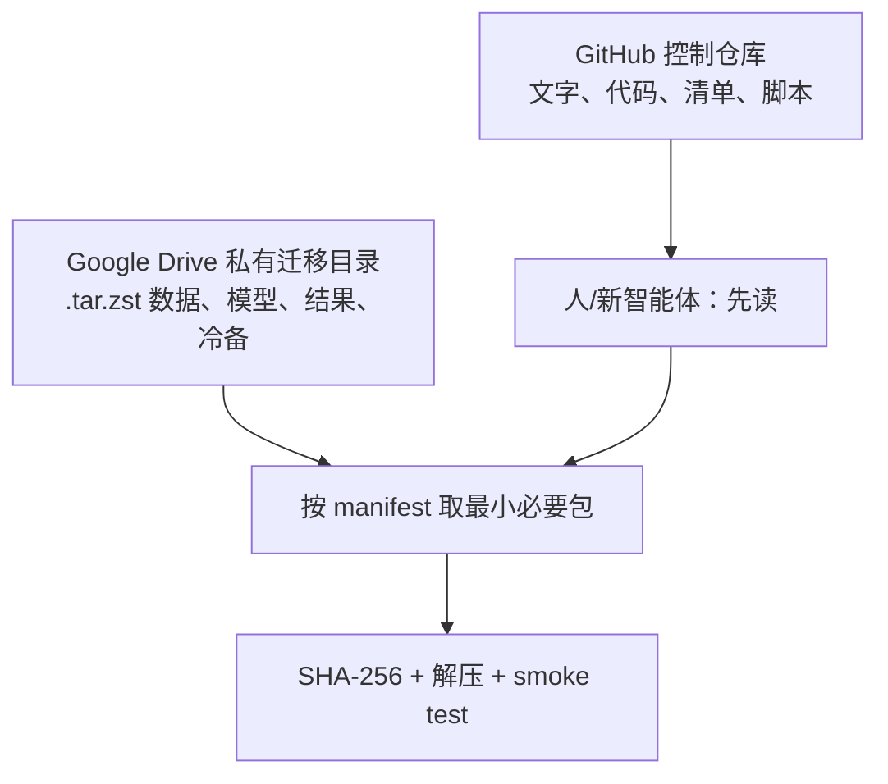

# 存储、访问与文件读取说明

## 两个目的地的职责



GitHub 是 **解释和定位的事实来源**；Google Drive 是 **大文件和私有制品的事实来源**。任何一个 Drive 包若没有 GitHub manifest，就不应被当作可恢复资产。

## 实际 Drive 目录约定

```text
00_迁移控制与清单/                 状态、清单快照、上传报告
01_CURRENT_GOAI_V7/
  01_DATA/                          官方数据与语义/descriptor 资产
  02_BASELINES/                     V7 三 seed 与 descriptor comparator
  03_PROMOTED_RESULTS/              AL 正式结果、BCR 结论证据
02_ARCHIVE_GOAI_STAGE1/             M12 与第一阶段精选包
03_ARCHIVE_GENEDISCO/               代码、论文、复现和 IL-2 pilot
04_ARCHIVE_BIOHUB/                  main/worktree 快照、bundle、模型、提交
90_CODEX_PRIVATE_COLD_BACKUP/       去凭据 Codex 三包；已按紧急授权直存用户私有 Drive
99_MANIFEST_SNAPSHOTS/              每一轮上传后的清单与校验和
10_全量研究备份_20260831/           第二波个人历史回溯层；状态与边界见 BULK_MIGRATION_20260831.md
  01_Project_研究工作区/             广泛 Project 快照（传输中）
  02_Biohub_原始数据与历史/
    durable_archive/                 仅 Biohub durable 的完整 `.tar.zst`；不含比赛 data
  03_Omics_GPU_历史资料/             GO-AI 直传、DiscoBAX archive、RNA transfer
  04_VirtualCODEX_完整研究档案/      用户个人内容；明确不含 mousebrain
  05_个人回收站研究恢复_20260831/    仅定向用户研究候选（部分传输中）；不计入第二波容量
```

每个二进制包采用 `*.tar.zst`。以后如另做加密最终 delta，可使用 `*.tar.zst.age` 或等价格式；本次 Codex 预快照的实际存储方式、哈希和排除项见 `MIGRATION_RECEIPT_20260831.md`。包内尽量保留原 `Project/...` 相对路径，因而可解压到新的项目根目录，而不是依赖服务器绝对路径。

## 第二波内容的读取边界

`10_全量研究备份_20260831/` 不等于已经验证的精选包。目录中可能同时存在“正在上传”“已传完待验”“已验证”的对象；下载前先读根 `MIGRATION_STATUS.md` 与 `BULK_MIGRATION_20260831.md`，再查该对象是否已有 checksum/manifest 记录。

* 直接目录（Project、Omics GO-AI、RNA、未来恢复的 VirtualCODEX）按所需相对路径最小化下载。不要把整个历史树同步到新机器，也不要把旧 OOF/checkpoint 自动接入 V7。
* `durable_archive` 和 DiscoBAX pilot 是压缩档案。先拿到文档中记录的 SHA-256，运行 checksum 与 `zstd -t`，可先 `tar -tf` 预览，再解压到独立恢复目录。
* `mousebrain/`、Biohub `data/`、Biohub `data.partial*` 和取消的 Biohub-data 临时 archive 永远不应出现在第二波 Drive 目录；它们的缺失是正确状态，不要尝试补传。
* 个人回收站只会定向恢复文档明确列出的用户研究候选。它不是“备份整个 Trash”的授权，也不自动获得与第二波同等的已验证状态。

## 如何读取一个 artifact

1. 在 `manifests/artifacts.yaml` 找逻辑 ID，例如 `goai-v7-three-seed-results-20260831`。
2. 记录其 Drive 相对路径、SHA-256、`extract_into` 和用途。
3. 用自己的 Drive OAuth 配置下载；不要复制旧服务器的 rclone 配置或 OAuth token。
4. 下载后运行 SHA-256 校验；校验通过才解压。
5. 解压后阅读包内 README/合同，或运行对应的 smoke test。

示意命令（remote 名称由新机器自行配置）：

```bash
rclone copy my_drive:'01_CURRENT_GOAI_V7/02_BASELINES/goai-v7-three-seed-results-20260831.tar.zst' ./artifacts/
sha256sum -c goai-v7-three-seed-results-20260831.sha256
mkdir -p ~/Project
tar --use-compress-program=zstd -xf goai-v7-three-seed-results-20260831.tar.zst -C ~/Project
```

## 访问边界

* 官方 GO-AI 训练表、Kaggle 模型/提交、Codex 会话与附件都只放私有 Drive，不进 GitHub。
* `auth.json`、`secrets/`、rclone config、OAuth token、API key、SSH key 永不放入任何迁移包。
* Codex 全史包含潜在敏感提示词和路径；本次已按用户明确授权上传去凭据压缩预快照到其私有 Drive，绝不进入 GitHub。未来需要更强保护时再制作加密 delta。
* 服务器是迁移期间的原件；Drive 上传成功不授权删除服务器文件。
