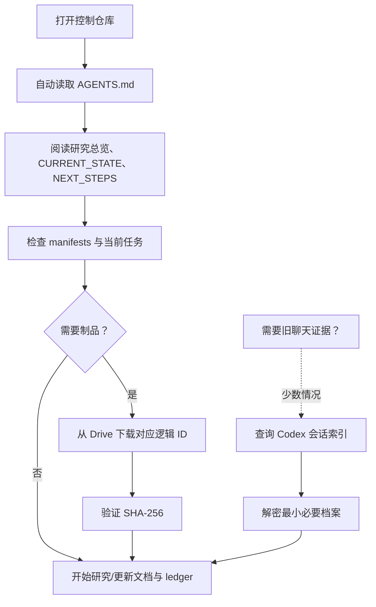

# Codex 完整归档、关键恢复与可读上下文指南

> 目的：即使旧服务器消失，也能同时做到两件事：
>
> 1. 在新机器上让新的 Codex/智能体立即理解当前研究并继续工作；
> 2. 在需要时完整回看旧服务器上的 Codex 历史、附件、会话和工作状态。

本指南把“新智能体理解研究”与“保留旧 Codex 全部历史”明确分开。前者依赖版本控制文档；后者依赖加密档案。两者都保留，但不互相混淆。

## 1. 两种恢复，不是一种

| 恢复目标 | 需要什么 | 默认使用场景 | 是否需要完整会话库 |
|---|---|---|---|
| 研究连续性 | GitHub 文档、代码、数据/制品 manifest、当前 V7 文件 | 新机器、新智能体、日常工作 | 否 |
| Codex 工作方式恢复 | 去密配置、rules、自定义 skills、关键状态数据库 | 新装 Codex 后恢复工作习惯 | 否，约 25 MB 即可 |
| 历史会话回看 | sessions、thread history、attachments、migration backups | 查旧结论、找旧附件、人工取证 | 是 |
| 完整灾难恢复 | 上述全部的加密快照 | 旧服务器彻底不可访问 | 是 |

因此，未来智能体不会被迫从数 GB JSONL 聊天记录中猜研究目标；它会先按仓库的 `AGENTS.md` 读结构化知识。完整历史只在需要回溯时打开。

OpenAI 官方文档说明，Codex 会在开始工作前发现并读取适用的 `AGENTS.md`，且项目内更深层的规则可覆盖通用规则。[AGENTS.md 文档](https://learn.chatgpt.com/docs/agent-configuration/agents-md) 官方文档也明确建议将必需指导放进 `AGENTS.md` 或受版本控制的文档，而不是只依赖本地 memories。[Memories 文档](https://learn.chatgpt.com/docs/customization/memories)

## 2. 旧服务器上的 Codex 盘点

本次只读取了结构、大小和文件类别，没有读取私密会话正文、token 或凭据。

| 部分 | 当前大小 | 作用 | 迁移级别 |
|---|---:|---|---|
| `sessions/` | 约 3.23 GB，539 个 JSONL | 原始会话记录 | 完整加密冷备 |
| provider migration backups | 约 2.01 GB | 迁移过程中的会话/状态备份 | 完整加密冷备 |
| `logs/` | 约 1.07 GB | 运行日志 | 不必恢复；可按需留原始档案 |
| `attachments/` | 约 497 MB | 用户上传的 CSV、ZIP、图等 | 筛选后归档，原件进入完整冷备 |
| thread history | 约 291 MB | 本地会话索引/历史 | 加密恢复包或完整冷备 |
| `worktrees/` | 约 21 MB | Codex 创建的工作树 | 代码优先导出；不可只当缓存 |
| `visualizations/` | 约 19 MB | 对话中生成的可视化 | 按研究价值筛选 |
| config/rules/skills | 约 2.6 MB | 个人/项目工作方式 | 去密版本进 GitHub；原件加密保存 |
| goals/state/memories/queue 等数据库 | 约 18.6 MB | 本地状态、目标、记忆、队列 | 加密关键恢复包 |
| `auth.json` 与 `secrets/` | 很小但极敏感 | 登录和密钥 | 不上传；新机器重新登录 |

最小的关键工作状态总计约 **21–25 MB**。它只用于恢复 Codex 的本地状态，不能取代研究文档。

### 特别优先事项：Biohub Codex worktree

`~/.codex/worktrees/9a74/Biohub - Cell Tracking During Development` 只有约 21 MB，但其中有约 260 个已修改或未跟踪条目。这是一份源码恢复优先级，而不是普通缓存：

1. 它必须被比较、导出为 patch 或并入 Biohub 代码快照；
2. 不能仅依靠完整 `.codex` 档案来保存它；
3. 在任何清理或删除前，必须验证主 Biohub 仓库已经拥有这些改动。

## 3. 最终保留的四个 Codex 包

Google Drive 中建立 `90_CODEX_ENCRYPTED_COLD_BACKUP/`，但以下包均使用客户端加密；加密密码/私钥不放在 GitHub 或普通 Drive 文档中。

| 包名（逻辑名称） | 内容 | 目标大小 | 恢复用途 |
|---|---|---:|---|
| `codex-research-context` | 会话摘要、研究决策、关键附件索引、可读说明 | 0.1–0.5 GB | 给人和新智能体理解历史 |
| `codex-core-recovery` | 原始配置、rules、skills、goals/state/memories/queue 数据库及 WAL/SHM | 约 25 MB | 恢复关键本地状态 |
| `codex-selected-evidence` | 选中的 PDF、图、CSV、ZIP、可视化和会话导出 | 0–0.5 GB | 保留不能被结构化文档代替的证据 |
| `codex-full-history` | 除凭据外的整个 `.codex` 历史快照 | 源目录约 7.3 GB | 灾难恢复与完整回溯 |

默认迁移包含这四类。因此完整迁移总量以 **12.6–13.5 GiB** 规划，而不是只按 5–6 GiB 的运行核心规划。

## 4. 每个内容放到哪里

### 4.1 GitHub：可读、可版本控制、可被智能体立即使用

进入 GitHub 的内容必须是无凭据、可阅读、可审阅的版本：

```text
AGENTS.md
docs/06_Codex_完整归档与恢复指南.md
docs/07_Codex_会话与上下文索引.md
projects/*/CURRENT_STATE.md
projects/*/DECISIONS.md
projects/*/NEXT_STEPS.md
ledgers/experiments.csv
manifests/artifacts.yaml
.codex/config.example.toml
rules/（去密后的必要规则）
自定义 skills 的源文件和说明
```

GitHub 中不出现任何 access token、refresh token、client secret、SSH 私钥、`auth.json`、`secrets/` 或实际 rclone 配置。

### 4.2 Google Drive：加密大文件与可回溯材料

```text
90_CODEX_ENCRYPTED_COLD_BACKUP/
├── 01_core_recovery/
├── 02_selected_evidence/
├── 03_full_history/
├── 04_worktree_patches/
└── 99_checksums_and_restore_notes/
```

每个文件都必须在 `manifests/artifacts.yaml` 有对应记录：逻辑 ID、原路径、用途、大小、SHA-256、加密方式、Drive 文件 ID、恢复优先级和最后验证时间。

### 4.3 不上传的认证材料

`auth.json`、`secrets/`、Google Drive OAuth token、Kaggle token、SSH 私钥均不放入 GitHub 或普通 Drive 文件夹。新机器的正确恢复方法是重新登录，如 `codex login`；若确实需要离线灾难保管凭据，只能由你个人使用独立的强加密离线介质保存。

## 5. 人如何完整阅读和理解 Codex 历史

### 第一步：先读结构化研究知识

不要先打开 539 个 session JSONL。先按以下顺序阅读：

1. `00_请先读我_服务器迁移总蓝图.md`
2. `docs/01_研究总览.md`
3. `docs/02_研究路线与决策史.md`
4. `projects/goai-v7-active-learning/CURRENT_STATE.md`
5. `projects/goai-v7-active-learning/NEXT_STEPS.md`
6. 本文第 2–4 节

完成后，读者已经知道时间线、项目边界、当前科研问题、数据位置和所有归档的角色。

### 第二步：使用会话与上下文索引

迁移阶段会生成 `docs/07_Codex_会话与上下文索引.md`，按以下维度索引重要会话：

| 字段 | 说明 |
|---|---|
| session ID / 文件名 | 原始会话的定位键 |
| 时间范围 | 发生时间 |
| 项目 | GeneDisco、Biohub、GO-AI stage 1、V7 或迁移 |
| 主题 | 例如“V7 reproduction”“M12 资料包”“Biohub worktree” |
| 结论 | 一两句人工/自动摘要 |
| 相关文件 | 仓库文件、Drive artifact 或旧服务器路径 |
| 证据级别 | 已验证、待确认、历史背景 |
| 归档位置 | 选择性导出或完整 history 包中的路径 |

读者应该从索引进入原始会话，而不是按日期盲目翻阅。

### 第三步：仅在需要时解密原始历史

例如，当需要确认“某个 M12 权重为何被保留”“某个 Biohub kernel 的最后修改来自哪里”时：

1. 先从索引找到会话 ID 或附件路径；
2. 下载并验证对应加密包的 SHA-256；
3. 解密到一个单独的只读恢复目录；
4. 查看需要的 JSONL、附件或 worktree patch；
5. 将确认后的结论写回 `DECISIONS.md` 或 ledger，避免下一次再次翻原始档案。

## 6. 新智能体的阅读和工作流程



新智能体绝不需要先恢复完整 `.codex`；这既慢，也会把旧的临时状态与新环境混在一起。完整历史是证据库，不是启动配置。

## 7. 恢复操作分级

### A. 日常新机器恢复（最常见）

1. 安装 Codex、Git、Python/Conda 和项目要求的工具；
2. 重新登录 Codex；
3. 克隆控制仓库；
4. 阅读 `AGENTS.md`；
5. 运行 `scripts/context_doctor.sh`；
6. 按 `artifacts.yaml` 下载当前 V7 所需文件；
7. 校验哈希后运行 smoke test。

这条路径不需要恢复原始 session、thread history 或日志。

### B. 恢复个人 Codex 工作状态

1. 关闭本机所有 Codex 进程；
2. 下载、校验并解密 `codex-core-recovery`；
3. 将去密配置和必要数据库恢复到新机器对应位置；
4. 不恢复 `auth.json` 和 `secrets/`，而是重新登录；
5. 启动 Codex，确认配置、rules、项目 `AGENTS.md` 和本地状态可读；
6. 运行 `context_doctor.sh`，以仓库文档纠正任何旧状态偏差。

### C. 完整历史/灾难恢复

1. 不覆盖新机器已有 `.codex`；先解密到独立目录；
2. 使用 checksums 校验完整 history 包；
3. 先检索会话索引，再查看原始 JSONL/附件；
4. 只有在确有需要时才手工合并部分状态；
5. 原始档案始终保持只读副本。

## 8. 最终快照如何保证一致性

迁移分为两次：

1. **初始快照**：服务器仍在使用时复制，可尽早发现空间、权限和上传问题。
2. **最终增量快照**：停止正在写入的实验并正常退出 Codex 后执行；对 SQLite 数据库必须同时保留主文件以及可能存在的 WAL/SHM 文件。

每一包都生成：

```text
<logical-name>.tar.zst.age
<logical-name>.sha256
<logical-name>.manifest.yaml
<logical-name>.restore.md
```

加密前和上传后都校验 SHA-256；Drive 文件 ID 写入 GitHub manifest。最终还要在另一目录或另一台机器上做一次恢复演练。

控制仓库提供 `scripts/create_codex_encrypted_snapshot.sh`：它只接受 `age1...` 公钥、强制生成客户端加密的 `.age` 包，并明确排除认证和 config；它还使用 SQLite `.backup` 处理核心状态。运行前仍应让 Codex 静默，运行后将 `.age` 与 `.sha256` 上传到 `90_CODEX_PRIVATE_COLD_BACKUP/`，私钥只由用户个人保存。

## 9. 什么会被主动排除

| 类别 | 原因 | 替代物 |
|---|---|---|
| `auth.json`、`secrets/` | 凭据不可安全上传 | 新机器重新登录；个人离线保管 |
| cache、tmp、IPC、shell snapshots | 可重建，且不解释研究 | 不保留 |
| 插件缓存/系统技能副本 | 可重新安装 | 仅保留自定义 skills 与版本说明 |
| logs | 对恢复研究无必要 | 仅在完整历史档案中按需保留 |
| 不相关会话 | 不帮助理解主线 | 会话索引只保留相关条目 |

## 10. 验收标准

迁移完成只有在以下条件同时满足时才成立：

- GitHub 仓库可让陌生读者在两小时内理解研究路线和当前目标；
- 新智能体可在不打开历史 session 的情况下说清当前 V7 的状态与下一步；
- Drive 中每个制品均有 manifest、大小和 SHA-256；
- `codex-core-recovery` 能恢复关键本地状态；
- `codex-full-history` 能独立解密和检索；
- Biohub worktree 改动已经变成普通源码提交或可验证 patch；
- 不含 token、私钥、`auth.json`、`secrets/` 的内容被上传到 GitHub 或普通 Drive 路径。
